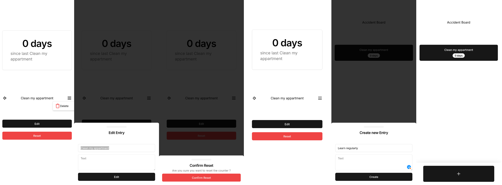

# DWA



This is a motivational app, where you can track how long you went without accident. You can reset your progress when you have an accident.

## Installation

You can just visit [https://quirinecker.github.io/dwa/](https://quirinecker.github.io/dwa/) and install the PWA on your device via chrome(android)/safari(ios).

## Development

The project is a Vue3/bun/vite project, so the instructions are relatively straight forward.

### Install dependencies

```bash
bun install
```

### Run the development server

```bash
bun run dev
```

### Build the application

```bash
bun run build
```

### Run the tests

```bash
bun run test
```

